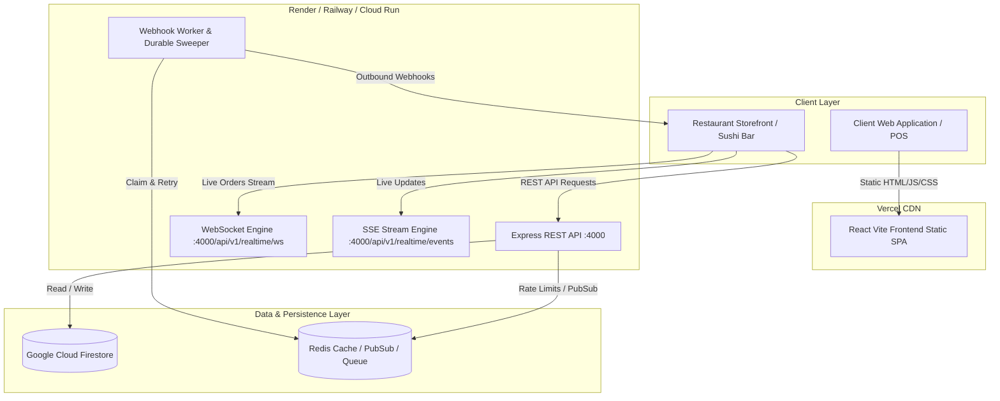

# RMS Backend Production Hosting Architecture Guide

This document compares cloud container hosting platforms for deploying the **RMS (Restaurant Management System) Express Backend** and provides deployment blueprints.

---

## 1. Hosting Platform Evaluation Matrix

| Capability | Render | Railway | Fly.io | Google Cloud Run |
| :--- | :--- | :--- | :--- | :--- |
| **Persistent Node.js Process** | ✅ Native Web Service | ✅ Native Service | ✅ Native Machines | ⚠️ Requires `min-instances: 1` |
| **WebSockets (`ws`)** | ✅ Fully Supported | ✅ Fully Supported | ✅ Supported (TCP/HTTP) | ✅ Supported (HTTP/1.1 & HTTP/2) |
| **Server-Sent Events (SSE)** | ✅ Supported | ✅ Supported | ✅ Supported | ✅ Supported (Set timeout > 300s) |
| **Background Webhook Sweeper**| ✅ Runs in process | ✅ Runs in process | ✅ Runs in process | ⚠️ Requires persistent instance |
| **Managed Redis Integration** | ✅ Available addon | ✅ 1-Click Redis Plugin | ✅ Fly Redis (Upstash) | ✅ Memorystore / External Redis |
| **Docker Build Support** | ✅ `server/Dockerfile` | ✅ `server/Dockerfile` | ✅ `server/Dockerfile` | ✅ Native Artifact Registry |
| **SSL / Custom Domains** | ✅ Automatic SSL | ✅ Automatic SSL | ✅ Automatic SSL | ✅ Automatic SSL |
| **Zero-Config Health Checks** | ✅ `GET /api/v1/health` | ✅ `GET /api/v1/health` | ✅ `GET /api/v1/health` | ✅ `GET /api/v1/health` |

> [!NOTE]
> **Pricing & Free-Tier Notice:**
> Cloud hosting pricing, trial credits, and free tier policies evolve frequently across all providers. Always check the respective provider's current pricing page (Render Pricing, Railway Pricing, Fly.io Pricing, Google Cloud Pricing) before deploying production workloads.

---

## 2. Platform Comparison Details

### 1. Render (Recommended for Simplicity & Speed)
- **Deployment Model:** Git-connected Web Service.
- **Root Directory:** Set Root Directory to `server/` (or use `server/Dockerfile`).
- **Build Command:** `npm ci && npm run build`
- **Start Command:** `npm run start`
- **Health Check Path:** `/api/v1/health`
- **Why It Fits:** Zero-downtime deploys, built-in TLS, out-of-the-box persistent WebSocket & SSE handling, native background workers.

### 2. Railway (Recommended for Developer Experience & Redis Bundling)
- **Deployment Model:** Multi-service project (Node Web Service + 1-Click Redis Service).
- **Configuration:** Set Root Directory to `/server` or use the provided `server/Dockerfile`.
- **Environment Linking:** Automatically injects `REDIS_URL` into the web service.
- **Health Check:** Configure `/api/v1/health` in Service Settings.

### 3. Fly.io (Recommended for Low Latency Edge Container Deployments)
- **Deployment Model:** Docker-based Micro-VMs running globally.
- **Configuration:** `fly launch` inside `/server` with `internal_port = 4000`.
- **WebSocket / SSE:** Supported over HTTP standard handlers.

### 4. Google Cloud Run (Recommended for Enterprise GCP Environments)
- **Deployment Model:** Serverless Container.
- **Critical Requirement:** You MUST configure **Minimum Instances = 1** (`--min-instances=1`) to prevent CPU throttling when idle, ensuring background webhook queues and real-time WebSocket listeners remain active.
- **Credentials:** Automatically leverages Google Application Default Credentials (ADC) for Firebase Admin without requiring manual private key files.

---

## 3. Recommended Production Architecture Blueprint



---

## 4. Step-by-Step Manual Deployment Walkthrough (e.g. Render)

1. Log in to [Render Dashboard](https://dashboard.render.com).
2. Click **New +** &rarr; **Web Service**.
3. Connect the GitHub repository: `SYSTEM-Mat3am-Antigravity`.
4. Configure service settings:
   - **Name:** `rms-api-production`
   - **Root Directory:** `server`
   - **Runtime:** `Node` (or `Docker` using `server/Dockerfile`)
   - **Build Command:** `npm ci && npm run build`
   - **Start Command:** `node dist/index.js`
   - **Instance Type:** Minimum 512MB RAM / 0.5 CPU.
5. In **Advanced Settings**, configure Health Check Path:
   - `/api/v1/health`
6. In **Environment Variables**, add the required variables:
   - `NODE_ENV=production`
   - `PORT=4000`
   - `ALLOWED_ORIGINS=https://your-frontend.vercel.app,https://your-restaurant-website.com`
   - `FIREBASE_PROJECT_ID=...`
   - `FIREBASE_CLIENT_EMAIL=...`
   - `FIREBASE_PRIVATE_KEY=...`
   - *(Optional)* `REDIS_URL=...`
7. Click **Create Web Service**.
8. Once deployment completes, copy your backend URL:
   `https://rms-api-production.onrender.com`
9. Test the health endpoint in your browser or curl:
   ```bash
   curl -I https://rms-api-production.onrender.com/api/v1/health
   ```
